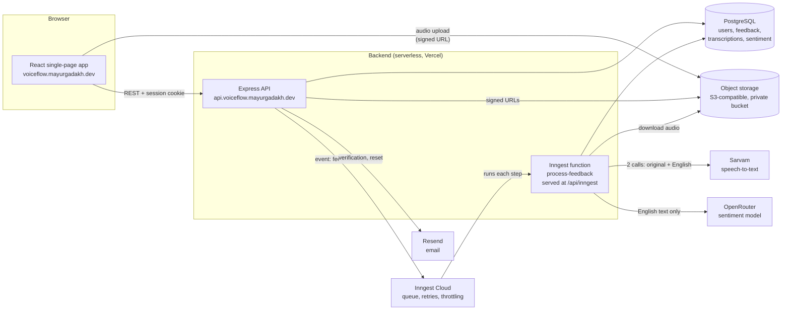
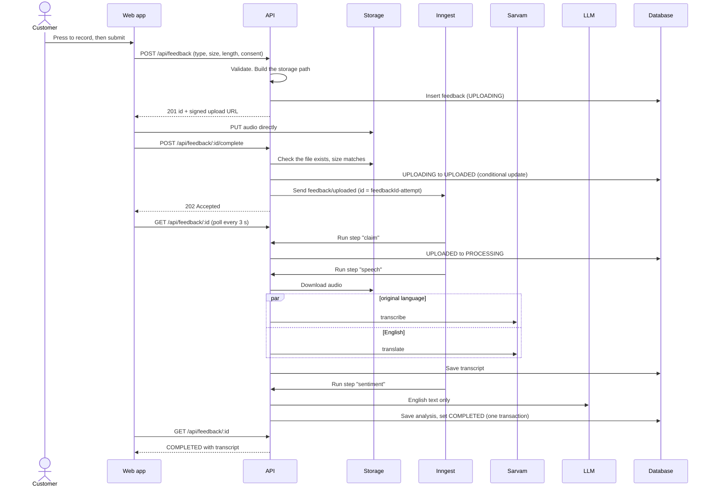
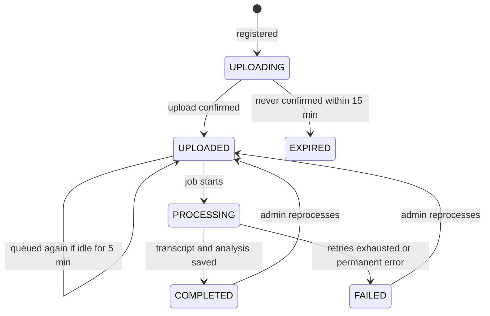
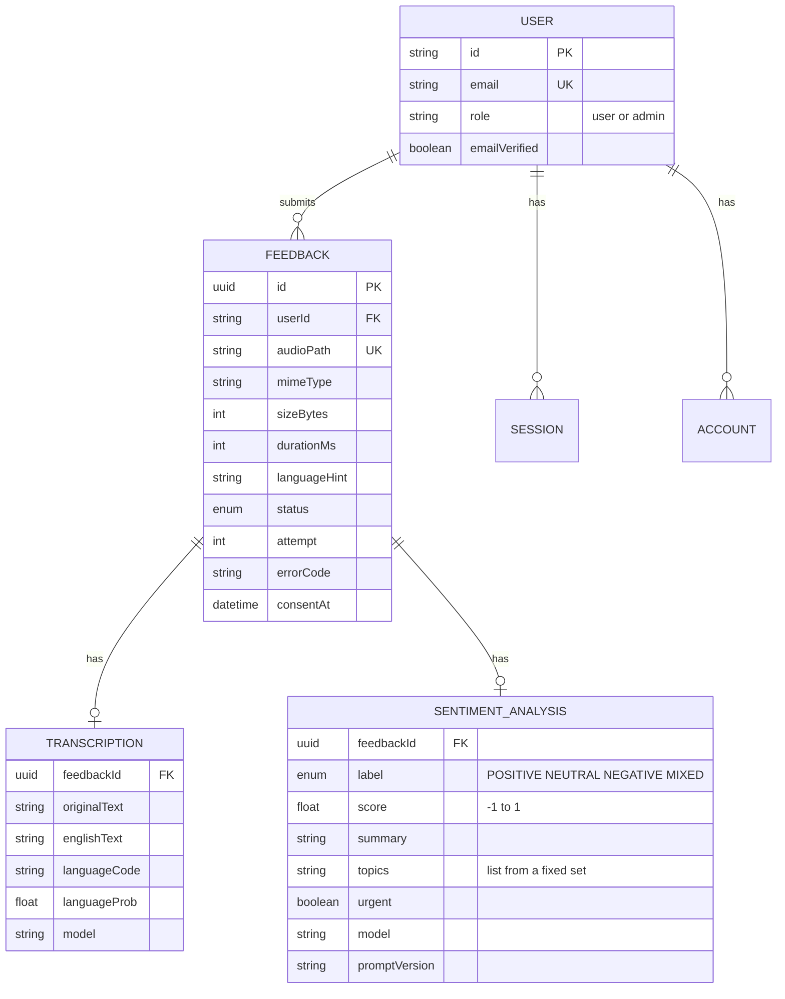

# Voiceflow architecture

Voiceflow lets customers record a short voice note about their order. The note is transcribed in its original language and in English, analysed for sentiment, and shown to admins who can listen to it, read it and see the overall picture.

- App: https://voiceflow.mayurgadakh.dev
- API: https://api.voiceflow.mayurgadakh.dev

## Contents

- [System overview](#system-overview)
- [What happens to a recording](#what-happens-to-a-recording)
- [Data model](#data-model)
- [Design decisions](#design-decisions)
- [Failure handling](#failure-handling)
- [Security and privacy](#security-and-privacy)
- [Bottlenecks and what changes at scale](#bottlenecks-and-what-changes-at-scale)

## System overview

| Part | Responsibility | Why this choice |
| --- | --- | --- |
| React SPA | Recording widget, customer history, admin dashboard | Static files, no server to run. Talks to one API origin |
| Express API | Auth, validation, signed URLs, reads and writes | Plain REST, easy to test and document. Stateless, so it scales horizontally |
| Object storage | Holds the audio | Audio is large and write-once. A database is the wrong place for it |
| PostgreSQL | Users, feedback state, transcripts, sentiment | Relational data with clear ownership, and filters and aggregates for the dashboard |
| Inngest | Runs the slow work in the background with retries | Transcription takes longer than a request should. See the decisions below |
| Sarvam | Speech-to-text | Built for Indian languages and code-mixed speech, which is who the customers are |
| OpenRouter | Sentiment analysis | One API for many models, so the model is a setting, not a code change |

## What happens to a recording

Each step is retried on its own. If sentiment fails, the transcript is already saved and the paid speech calls are not repeated.

### Feedback status

## Data model

The job state lives on the `feedback` row, so there is no separate queue table. `session`, `account` and `verification` are managed by Better Auth.

## Design decisions

### User experience

- **One action to start.** The record page is a single round button with a live waveform and a timer counting toward the 30-second cap, so people can see they are being heard.
- **Preview before submitting.** The customer plays the clip back and can record again. Consent is a required checkbox that names the AI services involved.
- **Never wait on the slow part.** Submitting returns as soon as the upload is confirmed (a 202). The result page shows progress and fills in the transcript by itself.
- **Language choice.** A picker with all 23 languages Sarvam supports, plus automatic detection. Choosing is more accurate for mixed speech, so the page says so.
- **Plain failure messages.** A silent recording says "we could not hear any speech", not an error code. Admins see the code too.
- **Admins read, they do not record.** The dashboard opens on an overview (sentiment, volume, topics, languages), then a filterable list, then a detail page with audio, both transcripts and the analysis. Filters live in the URL so views can be shared.

### API integration

- **Each vendor sits behind one small module** (`speech.service.ts`, `sentiment.service.ts`, `storage.service.ts`). Nothing else imports Sarvam, OpenRouter or the AWS SDK. Changing a provider means changing one file.
- **Failures are classified, not just caught.** A bad request or unreadable audio will never succeed, so it fails immediately with a code. A timeout, a 5xx or a rate limit is temporary, so it is retried with backoff. A 429 waits 30 seconds first. This stops the system from hammering a vendor and from retrying hopeless work.
- **Storage uses the S3 API,** not a vendor SDK. The same code runs on AWS S3, Supabase Storage, Cloudflare R2 and a local MinIO.
- **The model is a setting.** `SENTIMENT_MODEL` is an environment variable. The output is forced into a schema (label, score, summary, fixed topic list, urgent flag), so the dashboard can aggregate it. Output that does not fit is rejected, not stored.
- **Untrusted input.** The transcript is wrapped in delimiters and declared to be data, and the model receives only the English text, with no name, email or id.

### Latency

- **Audio goes straight to storage.** It never passes through the API, which avoids an extra hop and the request-size limits of serverless functions. The API only hands out a signed URL, which is cheap.
- **Processing is off the request path.** The customer is not waiting on transcription, so slow vendor calls do not make the app feel slow.
- **The two Sarvam calls run in parallel,** so a recording costs one call's time, not two.
- **Polling every 3 seconds** keeps the result page current without a persistent connection. For a clip of at most 30 seconds this is simple and cheap. Processing time has not been measured yet, so no figures are claimed here.
- **Admin audio is loaded on demand** with a 60-second signed link. The overview, list and detail pages are separate chunks, so customers never download the charting code.

### Scalability

- **The API is stateless.** Sessions are stored in the database and signed cookies carry no server state, so any number of instances can serve any request.
- **Heavy work is queued.** Inngest absorbs bursts and runs steps at a controlled rate. The pipeline is throttled to 25 runs a minute, which keeps two Sarvam calls per run inside Sarvam's 60 requests a minute limit.
- **A scheduled cleanup job** (every 10 minutes) expires abandoned uploads, queues stuck recordings again, and deletes audio after 30 days. Work per run is capped at 100 rows per task, so a run stays short and the rest waits for the next one.
- **Every step is safe to repeat.** The `claim` step is a conditional update, the transcript step checks for an existing transcript, and the final write is one transaction. Events carry an id made from the feedback id and the attempt number, so a duplicate is dropped but an admin's reprocess is not. The function also allows one run per recording at a time, so a re-sent event can never run beside the original.
- **Lists are cursor-paged** and backed by indexes on `(status, createdAt)` and `(userId, createdAt)`, so page cost does not grow with table size.
- **Storage and queue are managed services,** so audio volume and job volume do not depend on the API's size.

### Alternatives considered

| Decision | Chosen | Instead of | Trade-off accepted |
| --- | --- | --- | --- |
| Where audio goes | Direct upload with a signed URL | Upload through the API | The browser needs CORS on the bucket, and the API must verify the upload afterwards |
| Background work | Inngest | A hand-built queue and worker | Another vendor, but retries, throttling and per-step durability come ready made |
| Hosting | Serverless functions | A long-running server | No servers to manage, but function duration limits apply to the processing steps |
| Progress updates | Polling | WebSockets or server-sent events | Up to 3 seconds of delay, in exchange for no connection to keep alive |
| Transcript for English | Sarvam translate mode | A second model | One vendor, but the translation quality depends on Sarvam |
| Job state | A column on `feedback` | A separate jobs table | Simple and queryable, tied to one pipeline |

## Failure handling

| What goes wrong | What happens |
| --- | --- |
| Upload fails or never finishes | The customer sees an error and can try again. The row stays `UPLOADING` for 15 minutes, then the cleanup job marks it `EXPIRED` and deletes any file |
| Confirm is clicked twice | The second call gets 409. The status change is a conditional update, so it cannot happen twice |
| File missing or the wrong size at confirm | 400 `UPLOAD_MISSING`. Nothing is queued |
| Queue unreachable at confirm | The row stays `UPLOADED` and the customer still gets a response. After 5 minutes the cleanup job sends the event again |
| Sarvam rejects the audio (400, 403, 422) | No retry. Marked `FAILED` with `SPEECH_REJECTED` |
| No speech in the recording | No retry. `FAILED` with `NO_SPEECH`, and the customer is told in plain words |
| Sarvam is slow, down or rate limiting | Retried with backoff, up to 3 times, then `FAILED` with `PROCESSING_FAILED` |
| Model output does not match the schema | No retry. `FAILED` with `ANALYSIS_INVALID`, and the transcript is kept |
| Model provider outage | Retried like any temporary error |
| The same event arrives twice | The `claim` step finds the row already handled and stops |
| Audio deleted after 30 days | The cleanup job removes the file and marks the row. The admin page shows "audio removed" and the transcript remains |
| An admin reprocesses | A new attempt number gives a new event id, and the saved transcript is reused so speech is not paid for again |

Items that fail stay visible in the admin list with their error code, and an admin can reprocess them with one click.

## Security and privacy

- Roles are enforced by the API on every request. Signup cannot choose a role, and an admin is created only by a script.
- A customer can only ever see their own recordings, and asking for someone else's gives 404, not 403, so existence is not revealed. Admins cannot use the customer routes.
- The bucket is private. Upload URLs expire after 15 minutes and are bound to the exact content type and size. Playback URLs expire after 60 seconds.
- Recordings are limited to 30.5 seconds, 2 MB and three audio types, checked in the widget, the API and the signed URL.
- Audio is deleted after 30 days, and sooner for uploads that were never completed. Transcripts and analysis are kept.
- Consent is required and stored with a timestamp. The speech service gets audio only, and the sentiment model gets English text only.
- Row level security is on for every table with no policies, so the database provider's public REST API cannot read them.
- A voice clip is personal data. This design suits customer feedback. Health data would need more: data processing agreements with each vendor, a fixed data region, an audit log, and a health-data review.

## Bottlenecks and what changes at scale

| Bottleneck | Today | At larger scale |
| --- | --- | --- |
| Sarvam rate limit | 60 requests a minute, so the throttle allows at most 25 recordings a minute (two calls each) | Ask for a higher limit, or add a second provider behind the same service module |
| 30-second clips | Sarvam's REST API handles up to 30 seconds | Its batch API takes recordings up to 2 hours, at the cost of an asynchronous result |
| Function duration | Each speech step waits on two calls of up to 20 seconds | Needs a platform setting that allows long functions |
| Dashboard aggregates | Computed on each request from the tables | Cache them, or keep summary tables updated by the pipeline |
| Polling | Every customer page polls every 3 seconds | Server-sent events, or backoff on the polling interval |
| Database connections | One pool per function instance | A connection pooler in front of the database, which the current setup already uses |
| Noisy audio | A language-confidence badge only appears with auto-detect | Pre-processing, a confidence threshold that triggers human review, and per-language accuracy tracking |
